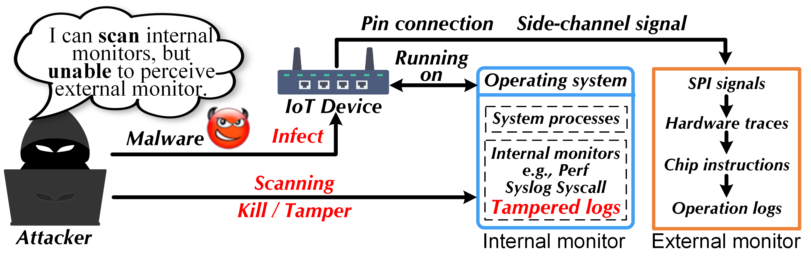
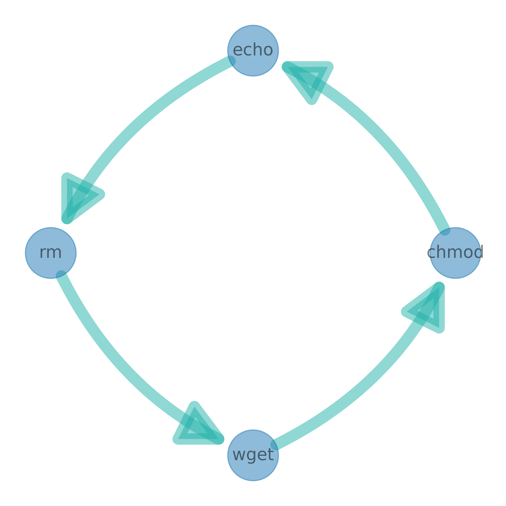
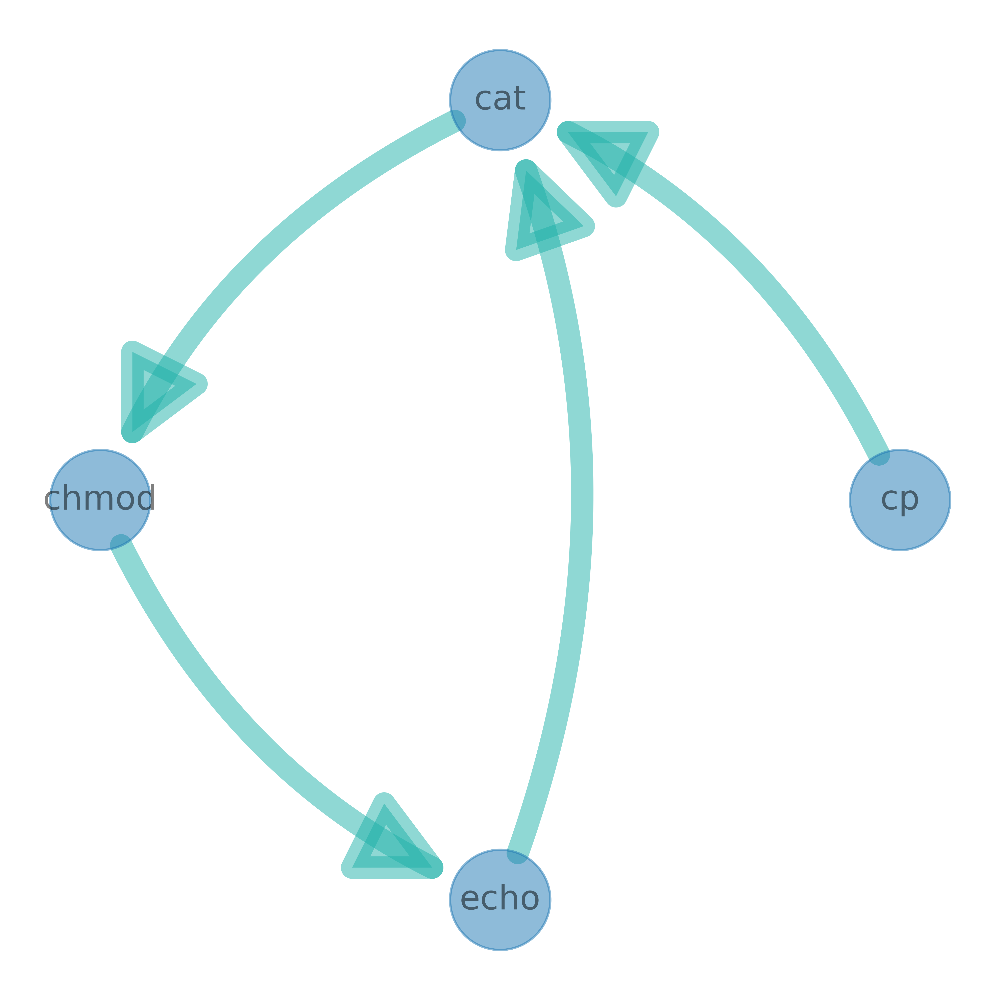
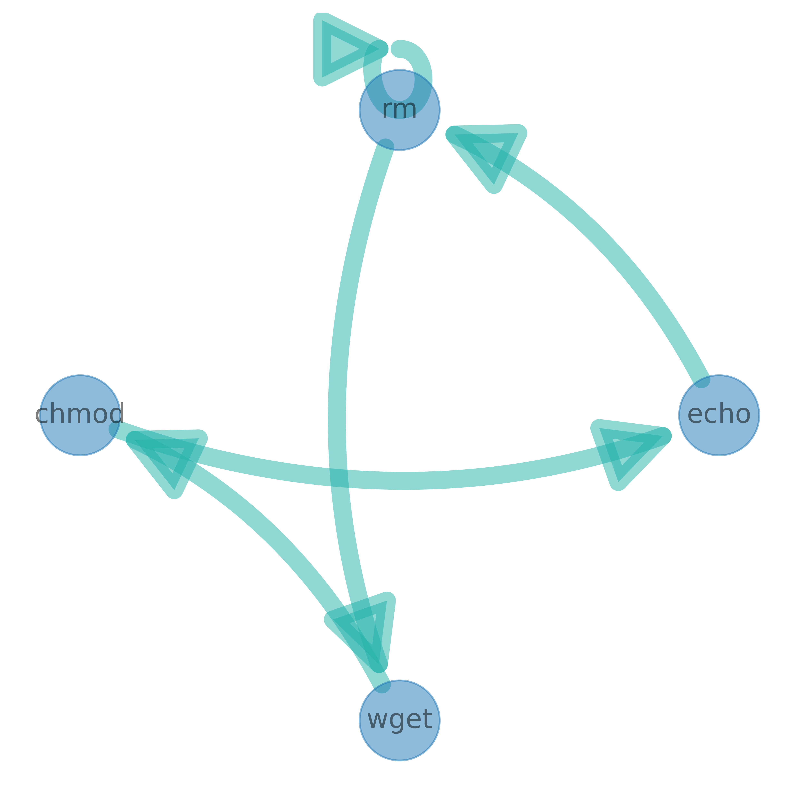
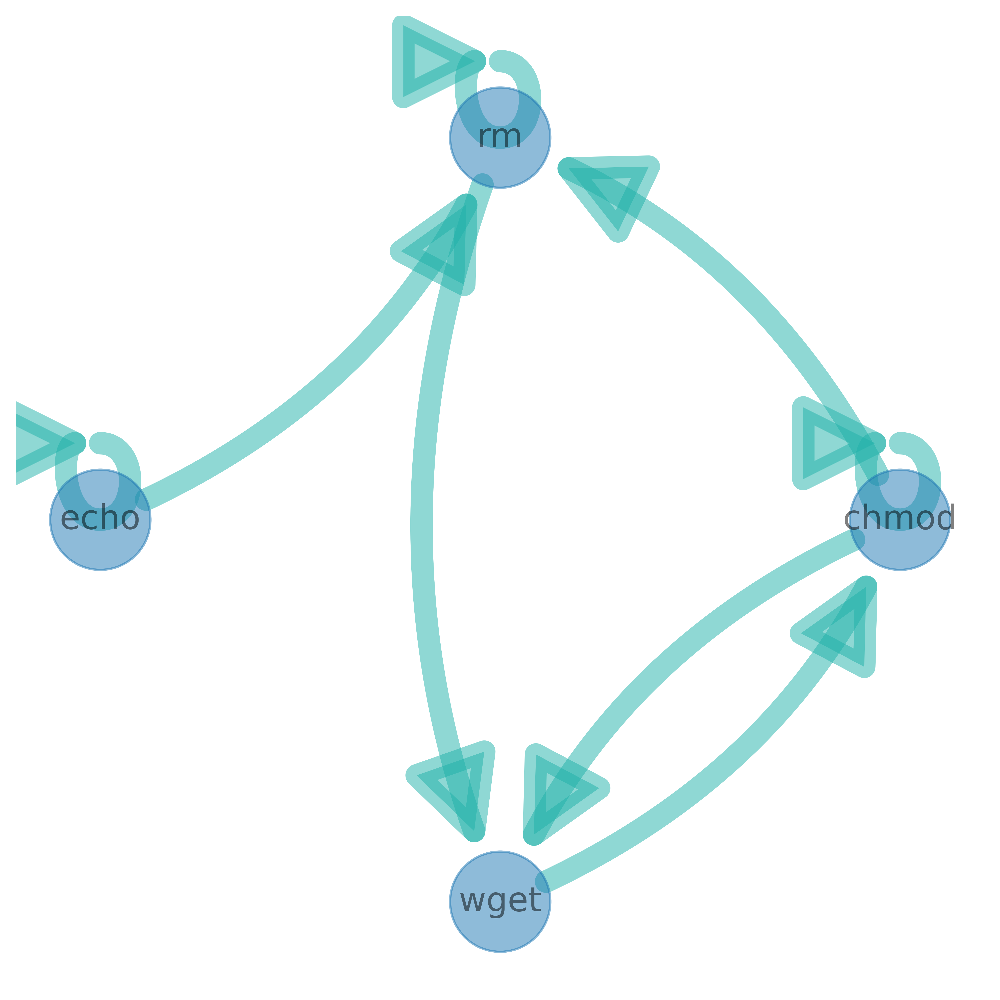
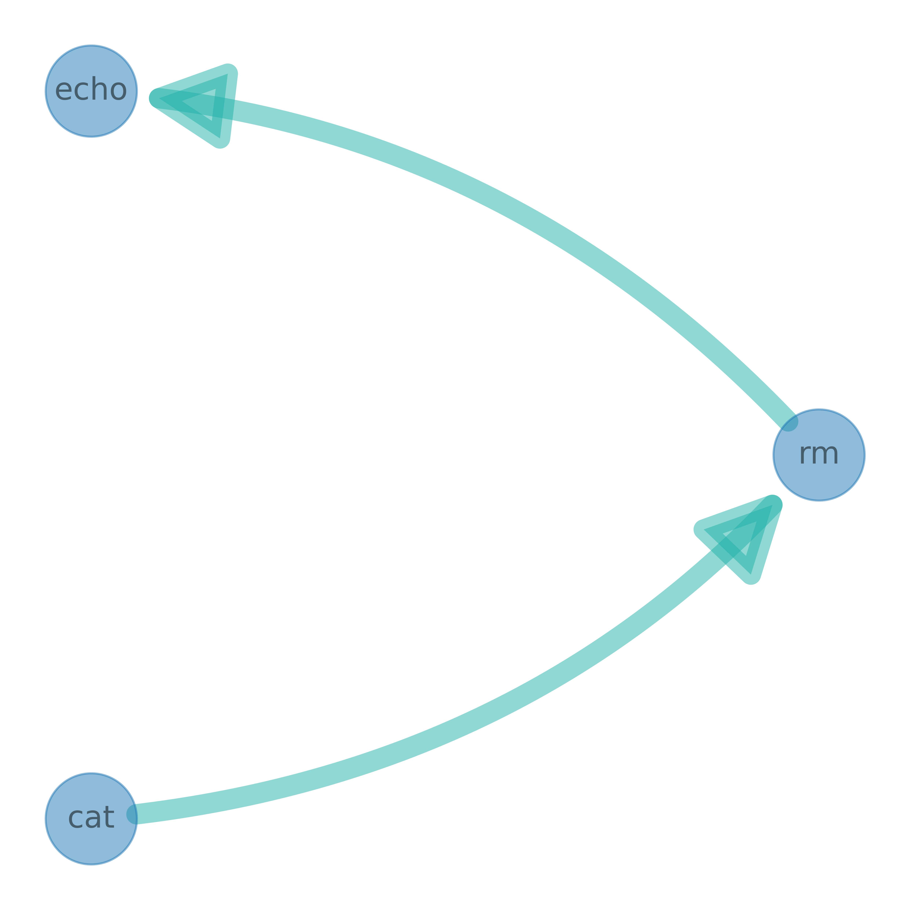
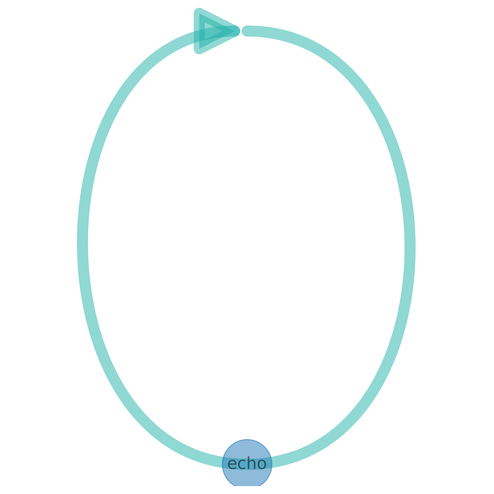

# TPE-Det



## Introduction

TPE-Det is a side-channel-based external monitor, to achieve tamper-proof and lightweight IoT malware detection. Specifically, TPE-Det leverages the SPI bus to extract the on-chip traces and designs a recovery pipeline for operating logs. It has tamper-proof capability, high detection accuracy, and low time/space overhead compared to state-of-the-art methods.


## Requirements

```bash
pip install scipy
pip install numpy
pip install pandas
pip install tqdm
pip install pyecharts
pip install joblib
pip install pickle
pip install sklearn
pip install torch
```

## Hardware

- W25Q128FV Flash chip: [W25Q128FV Datasheet](https://www.pjrc.com/teensy/W25Q128FV.pdf)

## Scripts

The code of flash data processing is stored in ./flash_processing/. 

The code of log recovery is stored in ./log_recovery/. 

The a series of models are stored in ./eval/base_models.py. 

## Instances

Some command graphs for malware instances

| VirusShare_00b5a5c21d5b89911e84a80d923b5000 | VirusShare_00d9df843850a81e19ceaf42a3818535 |
|--------------|--------------|
|  |  |

| VirusShare_398c5bfe9d59dde05c20345b6868b24b | VirusShare_00ea5d6594789de381770898062decfb |
|--------------|--------------|
|  |  |

| VirusShare_3b4c86047bdd8be4775d701c8c7568a1 | VirusShare_28a83e8582240ff0da872c18ba23623c |
|--------------|--------------|
|  |  |

Some command graphs for benign instances

| 1d25e87c2c8cc7050f51536185cb8ab7-AUG-service_routed-8 | 1d25e87c2c8cc7050f51536185cb8ab7-AUG-service_routed-10 |
|--------------|--------------|
|  |  |

| 1d25e87c2c8cc7050f51536185cb8ab7-AUG-service_routed-0 | 1d25e87c2c8cc7050f51536185cb8ab7-AUG-service_routed-1 |
|--------------|--------------|
|  |  |

| 1d874137093559d6b6429a83301e50ba-AUG-wifi_guest-2 | 1dc6a705f07b662c9335eae4d1672b43-AUG-nat-0 |
|--------------|--------------|
|  |  |

### References
- [Analyzing Hardware Based Malware Detectors](https://dl.acm.org/doi/10.1145/3061639.3062202), Nisarg Patel, Avesta Sasan, and Houman Homayoun - DAC 2017
- [Ensemble learning for effective run-time hardware-based malware detection: a comprehensive analysis and classification](https://dl.acm.org/doi/10.1145/3195970.3196047), Hossein Sayadi, Nisarg Patel, Sai Manoj P. D., Avesta Sasan, Setareh Rafatirad, and Houman Homayoun - DAC 2018
- [Hawkware: Network Intrusion Detection based on Behavior Analysis with ANNs on an IoT Device](https://ieeexplore.ieee.org/document/9218559), Sunwoo Ahn, Hayoon Yi, Younghan Lee, Whoi Ree Ha, Giyeol Kim, and Yunheung Paek - DAC 2020
- [DeepLog: Anomaly Detection and Diagnosis from System Logs through Deep Learning](https://dl.acm.org/doi/10.1145/3133956.3134015), Min Du, Feifei Li, Guineng Zheng, and Vivek Srikumar - CCS 2017
- [Structural Attack against Graph Based Android Malware Detection](https://dl.acm.org/doi/10.1145/3460120.3485387), Kaifa Zhao, Hao Zhou, Yulin Zhu, Xian Zhan, Kai Zhou, Jianfeng Li, Le Yu, Wei Yuan, and Xiapu Luo - CCS 2021
- [Interpretable Federated Transformer Log Learning for Cloud Threat Forensics](https://www.ndss-symposium.org/ndss-paper/auto-draft-236/), Gonzalo De La Torre Parra, Luis Selvera, Joseph Khoury, Hector Irizarry, Elias Bou-Harb, and Paul Rad - NDSS 2022
